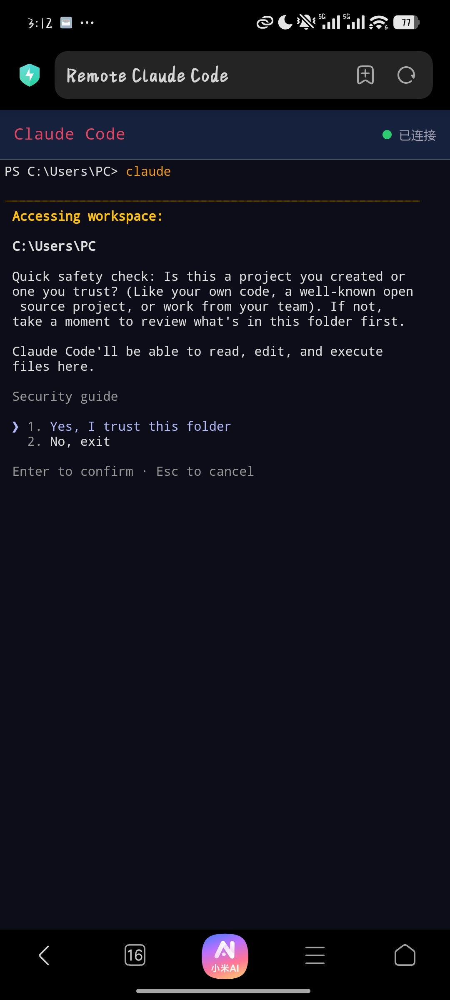

# Remote Claude Code

<p align="center">
  <a href="README.md">中文</a> |
  <a href="README_EN.md">English</a>
</p>

Access [Claude Code](https://claude.ai/code) running on your PC from your phone — no app, no cloud server, just a browser.

<p align="center">
  <strong>PC runs server → Phone browser opens → Scan QR or enter URL → Terminal connects</strong>
</p>

<p align="center">
  
</p>

---

## Architecture

```
┌──────────────────┐        WebSocket + HTTP         ┌──────────────────┐
│     Your PC       │ ◄════════════════════════════► │   Android Phone   │
│                   │        Same LAN / Hotspot       │   (Chrome)       │
│  node-pty ────────┤                                 ├──────────────────┤
│   ↓               │    xterm.js terminal            │                  │
│  Claude Code      │    Socket.IO real-time I/O      │  Web terminal    │
│  (PowerShell)     │    QR code auto-generation      │  No install      │
└──────────────────┘                                 └──────────────────┘
```

- **node-pty**: Creates a pseudo-terminal (PTY) on the PC running PowerShell / bash
- **xterm.js**: Renders a full terminal in the phone browser
- **Socket.IO**: Real-time bidirectional terminal I/O
- **Express**: Serves the static page and connection info API

## Features

- **Zero servers**: No cloud dependency — your PC is the server
- **Persistent sessions**: Closing the browser won't kill your Claude Code conversation; reconnect and pick up right where you left off
- **Multi-client**: Multiple devices can connect to the same terminal session simultaneously
- **QR code connect**: QR code auto-generated on PC; scan with your phone to connect instantly（cancel）
- **Cross-platform**: Windows, macOS, and Linux all supported
- **Auto-launch Claude Code**: Automatically runs `claude` on first connection
- **Browser detection**: Warns users when opened in unsupported browsers (WeChat, QQ, etc.)

## Quick Start

### Prerequisites

- **Node.js** ≥ 18 ([Download](https://nodejs.org/))
- **Claude Code** installed (`npm install -g @anthropic-ai/claude-code`)
- PC and phone on the **same LAN** (same WiFi), or PC running a mobile hotspot

### 1. Clone

```bash
git clone https://github.com/ZaraSheven/remote-claude-code.git
cd remote-claude-code
```

### 2. Install dependencies

```bash
npm install
```

### 3. Start the server

```bash
node server.js
```

Sample output:
```
══ Remote Claude Code ══

  Phone URL:  http://192.168.1.100:3456

  Claude Code auto-launches on first connection.
  Reconnecting resumes the same session.

══ Ctrl+C to stop ══
```

### 4. Connect from your phone

1. Make sure your phone is on the same WiFi
2. Open **Chrome** (do NOT use WeChat/QQ built-in browsers)
3. Enter the `Phone URL` shown in the terminal
4. Tap **「连接终端」(Connect Terminal)**

The PC automatically opens a browser showing a QR code — scan it with your phone to open the URL directly.

## Configuration

Customize behavior via environment variables:

| Variable | Default | Description |
|----------|---------|-------------|
| `PORT` | `3456` | Server port |
| `SHELL` | Windows: `powershell.exe`<br>Linux/Mac: `bash` | Terminal shell |
| `AUTO_CMD` | `claude` | Command to auto-run on first connection. Set to empty to disable |

### Examples

```bash
# Use port 8080, don't auto-launch Claude Code
PORT=8080 AUTO_CMD="" node server.js

# Use cmd.exe as shell (Windows)
SHELL=cmd.exe node server.js

# Use zsh (macOS)
SHELL=/bin/zsh node server.js
```

## Use Cases

| Scenario | Description |
|----------|-------------|
| Away from desk | Check long-running Claude Code tasks from your phone during meetings or lunch |
| Couch coding | Keep conversing with Claude Code without sitting at your desk |
| Quick questions | Fire off a question to Claude Code from your phone in seconds |
| Multi-device | PC runs the workload; phone and tablet both watch the same terminal |
| Campus / office LAN | No cloud needed — direct LAN access, zero mobile data usage |
| Demos & teaching | Tablet screen: handwritten notes + Claude Code terminal, side by side |
| Home users without public IP | No port forwarding, DDNS, or complex networking — LAN just works |

## Limitations

This is an early-stage project. Some known constraints:

### Network

- **LAN only**: PC and phone must be on the same WiFi (or connected via hotspot). No cross-internet remote access
- Cross-network access requires extra setup (VPN / SSH tunnel / frp)
- Some routers enable AP/client isolation by default, blocking device-to-device communication

### Functionality

- **Single session**: All connected devices share one terminal — no independent sessions
- **No authentication**: Anyone on the LAN who knows the IP and port can access the terminal
- **Phone keyboard**: Complex editing is less comfortable than a physical keyboard
- **Windows firewall**: First run requires admin privileges to add a firewall rule
- PC must stay powered on; sleep or shutdown disconnects the session
- `node-pty` may need Visual C++ runtime on some Windows installations

### Compatibility

- **WeChat/QQ built-in browsers are NOT supported** (no WebSocket support). Use Chrome or Edge
- iOS Safari not thoroughly tested (should work in theory)
- Only tested with Claude Code; other terminal applications not verified

> Having trouble? Check the [Troubleshooting](#troubleshooting) section or file an [Issue](https://github.com/ZaraSheven/remote-claude-code/issues).

## Contributing

This project was born from a simple wish: "I want to code from my bed using my phone." It's entirely passion-driven.

**All contributions are welcome:**

- Bug reports & feature requests → [Issues](https://github.com/ZaraSheven/remote-claude-code/issues)
- Code → Fork + PR (small, focused changes are preferred over massive refactors)
- Documentation → Typos, clarifications, translations — all valuable
- Spread the word → ⭐ **Star** the repo — it's the best motivation

**Some ideas for contributions:**

- [ ] Optional authentication (password / token)
- [ ] Multiple independent tab sessions
- [ ] iOS Safari testing & fixes
- [ ] Guide for remote access via frp / Tailscale
- [ ] Docker one-click deployment
- [ ] PWA support (add to phone home screen)
- [ ] Terminal font size controls
- [ ] File upload / download

Every star, every issue, every PR makes this project better.

---

## Cross-Platform Support

| Platform | Shell | Extra Args | node-pty |
|----------|-------|------------|----------|
| Windows | PowerShell | `-ExecutionPolicy Bypass` | ✅ |
| macOS | bash | none | ✅ |
| Linux | bash | none | ✅ |

One codebase, zero platform-specific configuration. `node-pty` ships prebuilt binaries for all platforms.

## Troubleshooting

### Phone can't connect

**1. Check same network**

Phone and PC must be on the same WiFi. Try opening the PC's IP address in your phone browser as a basic connectivity test.

**2. Check firewall**

Windows Firewall blocks inbound connections by default. Run as Administrator:
```powershell
New-NetFirewallRule -DisplayName "Remote Claude Code" `
  -Direction Inbound -Protocol TCP -LocalPort 3456 -Action Allow
```

**3. Router AP isolation**

Some routers (e.g., Xiaomi) enable AP/client isolation by default, preventing WiFi devices from talking to each other. Fix:
- Disable "AP Isolation" / "Client Isolation" in router settings
- Or run a mobile hotspot on the PC and connect the phone to that

**4. Verify the correct IP**

The server filters out virtual adapters (VMware, VirtualBox, etc.) and only shows physical network IPs. Use the IP displayed in the terminal.

### WeChat QR scan doesn't work

WeChat's built-in browser lacks WebSocket support. The page shows a red warning bar. Tap the top-right menu → **Open in Browser**, and use Chrome or Edge.

### `claude` command blocked (PowerShell execution policy)

The server already passes `-ExecutionPolicy Bypass` to handle this. If you still see errors, run manually:

```powershell
Set-ExecutionPolicy -ExecutionPolicy RemoteSigned -Scope CurrentUser
```

### Port already in use

```
Error: Port 3456 is already in use.
```

Find and kill the process:
```bash
netstat -ano | findstr 3456
taskkill /PID <pid> /F
```

Or use a different port: `PORT=3457 node server.js`

## Project Structure

```
remote-claude-code/
├── server.js          # Core: Express + Socket.IO + node-pty
├── package.json       # Dependencies
├── start.bat          # Windows one-click launcher
├── fix-network.ps1    # Network fix script (run as Admin)
├── hotspot-server.bat # Hotspot mode launcher
├── .gitignore
├── README.md          # Chinese docs
├── README_EN.md       # This file
└── public/
    └── index.html     # Frontend: xterm.js terminal + QR + responsive layout
```

## Security

- The server listens on all LAN interfaces — **any device on the same LAN can connect**
- Only use on trusted networks (home, campus, office)
- Stop the server (`Ctrl+C`) when not in use
- Do NOT use on public WiFi
- Combine with VPN / SSH tunneling for encrypted remote access

## Support

If this project helped you, consider buying the author a coffee.

<p align="center">
  <table>
    <tr>
      <td align="center"><b>WeChat</b></td>
      <td align="center"><b>Alipay</b></td>
    </tr>
    <tr>
      <td></td>
      <td></td>
    </tr>
  </table>
</p>


## License

[MIT](LICENSE) — Free to use, modify, and distribute. Just keep the copyright notice.
